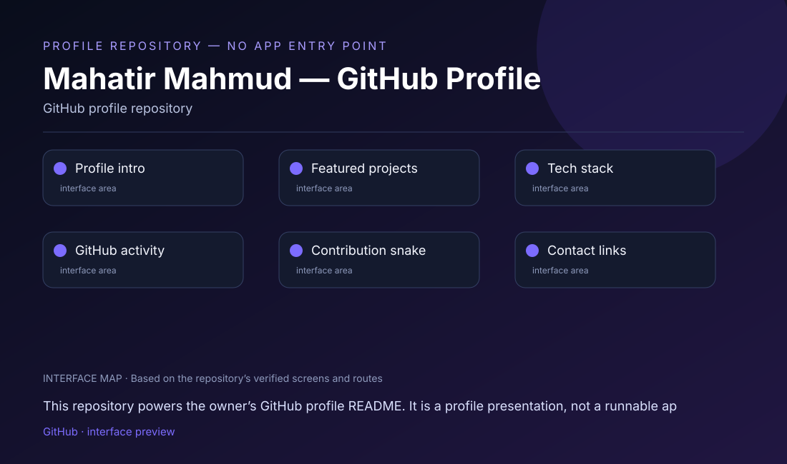

# Mahatir Mahmud — GitHub Profile

## What this project is

This repository powers the owner’s GitHub profile README. It is a profile presentation, not a runnable application.

## Interface at a glance

This repository contains or plans the following visitor-facing areas:

- **Profile intro**
- **Featured projects**
- **Tech stack**
- **GitHub activity**
- **Contribution snake**
- **Contact links**

The visual map above is based on the actual repository structure. It is deliberately labeled as an **interface map**, not a fabricated product screenshot.

## Run / view

Open the rendered profile on GitHub. There is no local app to install or start.

**Repository link:** [https://github.com/mahatirmahmud688601-wq](https://github.com/mahatirmahmud688601-wq)

## Project status

> PROFILE REPOSITORY — NO APP ENTRY POINT

The featured project links below point visitors to the individual projects. Statistics and activity widgets are external images and may change availability.

## Repository notes

- Keep API keys, OAuth secrets, signing keys, and private environment files out of Git.
- Add a verified public demo, APK, or release link here when one is available.
- Add real screenshots from the running app after the required local dependencies and credentials are configured.

## Technology

GitHub profile repository

---

Maintained by [mahatirmahmud688601-wq](https://github.com/mahatirmahmud688601-wq).
